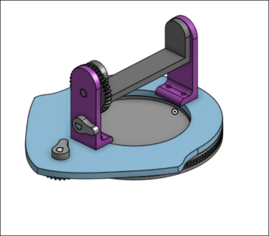
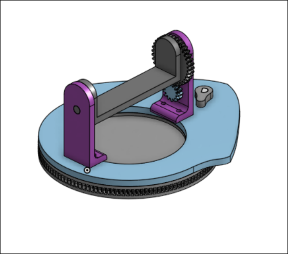
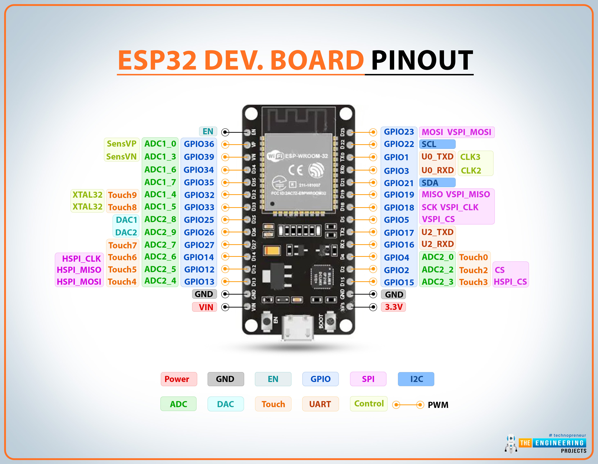

# Jammer
Have you ever been biking around the city and wanted privacy. Maybe preventing lights from monitoring you for nefarious reasons. Jammer is intended to blind camera allowing you to gain some privacy back!

<table align="center">
  <tr>
    <td></td>
    <td></td>
  </tr>
</table>

# Requirements
In order to work with Jammer you need an *ESP32* device working with the *ESP-IDF* library.

## Resources
+ ESP32DEVKITV1 Microcontroller
+ Breadboard/protoboard
+ IR Sensor
+ IFR Laser

## Software
For the ESP32DEVKITV1 you need to determine what drivers to install. On Linux the drivers may be included such as _Arch Linux_. However, for others, the drivers are most likely the CP210X drivers. They may vary depending on the chip manufacturer but is located on the MC.

## Terminal/IDE Setup
### ESP-IDF
In order to work with the ESP32 you need ESP-IDF, installed with the following commands:

```bash
mkdir -p ~/esp
cd ~/esp
git clone --recursive https://github.com/espressif/esp-idf.git
cd esp-idf
./install.sh esp32
. ./export.sh
```

For easier usage create an alias in the terminal file.


```bash
# Example: In a .zshrc file
alias get_idf='. $HOME/esp/esp-idf/export.sh'
```

# Pin Layout

<p align="center">
    
</p>

<p align="center">
    Credit: <a href="https://images.theengineeringprojects.com/image/main/2024/03/esp32-pinout.jpg">The Engineering Projects</a>
</p>

# Files
```
Jammer
├── CMakeLists.txt
├── src/
│   ├── CMakeLists.txt
│   └── jammer.c
└── cad/
    ├── platform.3df
    └── left.3df
```
